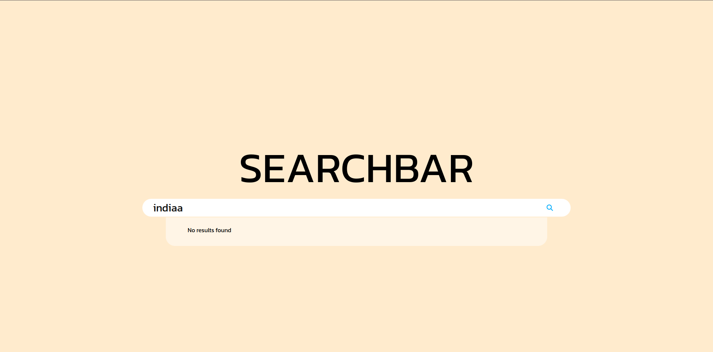

npm start

# debouncing
 use setTimeOut : 
    it returns a timerId that we can use to check pending api call

## Searchbar component using reactjs

#### Example:

TweetWorld 

An application used to search data form restCountries api, built with React, JavaScript,HTML and CSS.

## Project Screen Shot(s)
main page
   

result suggestion
   

no results
   

loading
   

before using debouncing:
   
 
after using debouncing:
   

## Installation and Setup Instructions

Clone down this repository. You will need `node` and `npm` installed globally on your machine.  

Installation:

`npm install`   

To Start Server:

`npm start`  

To Visit App:

`localhost:3000`  

## Reflection

  - This is my first project in journey of learning reactjs
  - I followed a youtube video to build this project
  - I learnt about
      - setState
      - event loop
      - map and filter functions
      - fetch api (async await)
      - debouncing concept
  - Figuring out about Event properties in js was most challenging thing in this project and i used w3schools to clear my doubts
  - I used
      - Reactjs
      - html
      - css
      - javascript
      - nodejs
      - git and github
  - Time spent on this project is approx 4 hrs